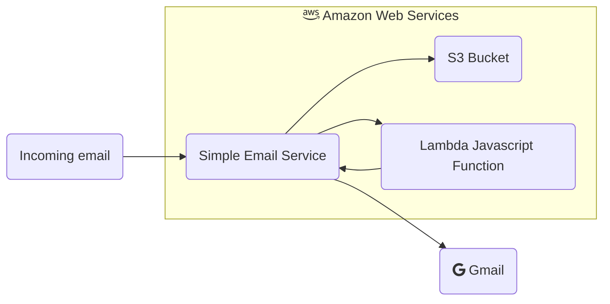
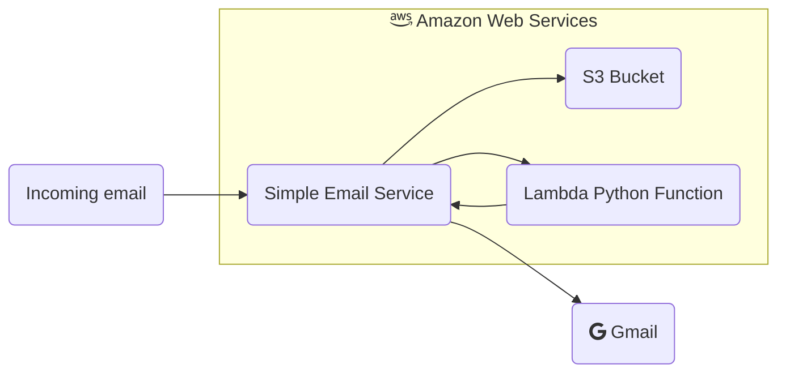

It's been awhile since I've looked at the email forwarding I set up in [this post](). In general, it's been working fine so why change it? Well, the last couple of months has introduced more and more spam into my account. I took this opportunity to simplify the code, convert to a language I'm more familiar with (Python), and set up to introduce a custom spam filter.

Let's take a look at what exists now:



## Converting from JavaScript to Python

The first and relatively easy change was to shift away from JavaScript, a language I'm not as strong with, over to Python, a language I program in everyday. AWS posted this snippet in a [blog on October 2019](https://aws.amazon.com/blogs/messaging-and-targeting/forward-incoming-email-to-an-external-destination/) that has a sample Python script to forward incoming SES emails to another email address. Following the instructions in the blog post, I applied it to my SES account. However, I found that code to be a bit of a pain.

First, the Python code creates an new email and attaches the incoming email, as opposed to just forwarding the email. I would rather just see the email directly so using this [StackOverflow response](https://stackoverflow.com/a/62356723/3294741) as a guideline, I updated the code to recreate the email and send it along.

```python
import os
import boto3
import email
import re
import html
from botocore.exceptions import ClientError
from email.mime.multipart import MIMEMultipart
from email.mime.text import MIMEText
from email.mime.application import MIMEApplication
from email.mime.image import MIMEImage
from email.utils import formataddr

region = os.environ['Region']

def get_message_from_s3(message_id):

    incoming_email_bucket = os.environ['MailS3Bucket']
    incoming_email_prefix = os.environ['MailS3Prefix']

    if incoming_email_prefix:
        object_path = (incoming_email_prefix + "/" + message_id)
    else:
        object_path = message_id

    object_http_path = (f"http://s3.console.aws.amazon.com/s3/object/{incoming_email_bucket}/{object_path}?region={region}")

    # Create a new S3 client.
    client_s3 = boto3.client("s3")

    # Get the email object from the S3 bucket.
    object_s3 = client_s3.get_object(Bucket=incoming_email_bucket, Key=object_path)

    # Read the content of the message.
    file = object_s3['Body'].read()

    file_dict = {
        "file": file,
        "path": object_http_path
    }

    return file_dict

def create_message(file_dict):

    stringMsg = file_dict['file'].decode('utf-8')

    # Create a MIME container.
    msg = MIMEMultipart('alternative')

    # sender = os.environ['MailSender']
    sender = formataddr((os.environ['MailSenderDisplayName'], os.environ['MailSender']))
    recipient = os.environ['MailRecipient']

    # Parse the email body.
    mailobject = email.message_from_string(file_dict['file'].decode('utf-8'))

    # Get original sender for reply-to
    from_original = mailobject['Return-Path']
    from_original = from_original.replace('<', '');
    from_original = from_original.replace('>', '');
    print(f"from: {from_original}")

    # Create a new subject line.
    subject = mailobject['Subject']
    print(f"subject: {subject}")

    if mailobject.is_multipart():

        for part in mailobject.walk():
            ctype = part.get_content_type()
            cdispo = str(part.get('Content-Disposition'))

            # case for each common content type
            if ctype == 'text/plain' and 'attachment' not in cdispo:
                bodyPart = MIMEText(part.get_payload(decode=True), 'plain', part.get_content_charset())
                msg.attach(bodyPart)

            if ctype == 'text/html' and 'attachment' not in cdispo:
                mt = MIMEText(part.get_payload(decode=True), 'html', part.get_content_charset())
                email.encoders.encode_quopri(mt)
                del mt['Content-Transfer-Encoding']
                mt.add_header('Content-Transfer-Encoding', 'quoted-printable')
                msg.attach(mt)

            if 'attachment' in cdispo and 'image' in ctype:
                mi = MIMEImage(part.get_payload(decode=True), ctype.replace('image/', ''))
                del mi['Content-Type']
                del mi['Content-Disposition']
                mi.add_header('Content-Type', ctype)
                mi.add_header('Content-Disposition', cdispo)
                msg.attach(mi)

            if 'attachment' in cdispo and 'application' in ctype:
                ma = MIMEApplication(part.get_payload(decode=True), ctype.replace('application/', ''))
                del ma['Content-Type']
                del ma['Content-Disposition']
                ma.add_header('Content-Type', ctype)
                ma.add_header('Content-Disposition', cdispo)
                msg.attach(ma)

    # not multipart - i.e., plain text, no attachments
    else:
        body = MIMEText(mailobject.get_payload(decode=True), 'UTF-8')
        msg.attach(body)

    # Add subject, from and to lines.
    msg['Subject'] = subject
    msg['From'] = from_original
    msg['To'] = sender
    msg['reply-to'] = from_original

    message = {
        "Source": sender,
        "Destinations": recipient,
        "Data": msg.as_string()
    }
    return message

def send_email(message):
    aws_region = os.environ['Region']
    # Create a new SES client.
    client_ses = boto3.client('ses', region)
    # Send the email.
    try:
        #Provide the contents of the email.
        response = client_ses.send_raw_email(
            Source=message['Source'],
            Destinations=[
                message['Destinations']
            ],
            RawMessage={
                'Data':message['Data']
            }
        )

    # Display an error if something goes wrong.
    except ClientError as e:
        print('send email ClientError Exception')
        output = e.response['Error']['Message']
    else:
        output = "Email sent! Message ID: " + response['MessageId']

    return output

def lambda_handler(event, context):
    # Get the unique ID of the message. This corresponds to the name of the file in S3.
    message_id = event['Records'][0]['ses']['mail']['messageId']
    print(f"Received message ID {message_id}")

    # Retrieve the file from the S3 bucket.
    file_dict = get_message_from_s3(message_id)

    # Create the message.
    message = create_message(file_dict)

    # Send the email and print the result.
    result = send_email(message)
    print(result)
```

## Updating the list of Environment variables

While updating the code for python, I had to update the list of environment variables. I settled on some additional variables to support the email address formatting. 

**MailRecipient**: Gmail address I forward emails to.
**MailS3Bucket**: S3 bucket that receives email. 
**MailS3Prefix**: S3 bucket prefix.
**MailSender**: AWS SES email address
**MailSenderDisplayName**: String for the display name.
**Region**: Region of the S3 bucket.

## There's still more to do...

I was able to replicate and get the forwarding to be easier maintained, but it's still imperfect. I need to expand to potentially include forwarding from a different verified AWS SES email, or at least create a more creative way. Either way, this is where I ended up in my arcitecture diagram.



Next up is inserting a more sophisticated spam filter that can also address a more sophisticated forwarding function.