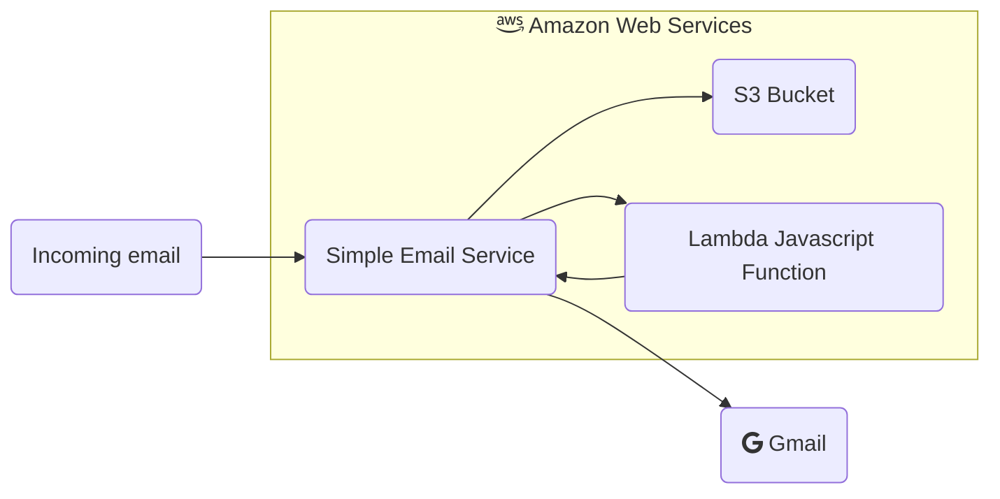

It's been awhile since I've looked at the email forwarding I set up in [this post](). In general, it's been working fine so why change it? Well, the last couple of months has introduced more and more spam into my account. I took this opportunity to simplify the code, convert to a language I'm more familiar with (Python), and set up to introduce a custom spam filter.

Let's take a look at what exists now:

